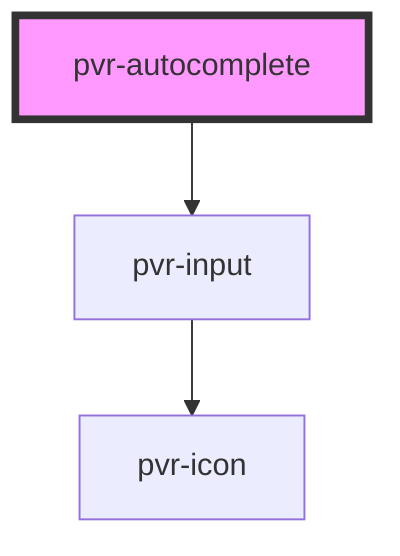

# pvr-autocomplete

<!-- Auto Generated Below -->

## Properties

| Property      | Attribute     | Description | Type      | Default     |
| ------------- | ------------- | ----------- | --------- | ----------- |
| `async`       | `async`       |             | `boolean` | `undefined` |
| `noResults`   | `no-results`  |             | `string`  | `undefined` |
| `options`     | --            |             | `any[]`   | `undefined` |
| `placeholder` | `placeholder` |             | `string`  | `undefined` |
| `width`       | `width`       |             | `string`  | `undefined` |

## Events

| Event           | Description | Type               |
| --------------- | ----------- | ------------------ |
| `pvrKeyPress`   |             | `CustomEvent<any>` |
| `pvrSelectItem` |             | `CustomEvent<any>` |

## Dependencies

### Depends on

- [pvr-input](../pvr-input)

### Graph

----------------------------------------------

*Built with [StencilJS](https://stenciljs.com/)*
