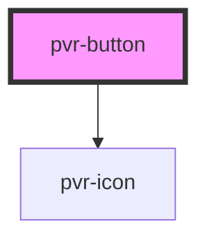

# pvr-button

<!-- Auto Generated Below -->

## Properties

| Property   | Attribute  | Description | Type                                                                                              | Default     |
| ---------- | ---------- | ----------- | ------------------------------------------------------------------------------------------------- | ----------- |
| `border`   | `border`   |             | `boolean`                                                                                         | `false`     |
| `disabled` | `disabled` |             | `boolean`                                                                                         | `false`     |
| `icon`     | `icon`     |             | `"check" \| "close" \| "download" \| "search" \| "settings" \| "stack" \| "sync" \| "transcribe"` | `null`      |
| `size`     | `size`     |             | `"large" \| "normal" \| "small"`                                                                  | `"normal"`  |
| `type`     | `type`     |             | `"primary" \| "red" \| "secondary" \| "silent" \| "warning"`                                      | `"primary"` |

## Dependencies

### Depends on

- [pvr-icon](../pvr-icon)

### Graph

----------------------------------------------

*Built with [StencilJS](https://stenciljs.com/)*
