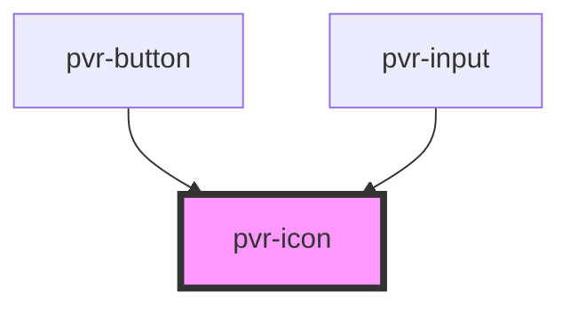

# pvr-button

<!-- Auto Generated Below -->

## Properties

| Property | Attribute | Description            | Type                                                                                              | Default     |
| -------- | --------- | ---------------------- | ------------------------------------------------------------------------------------------------- | ----------- |
| `type`   | `type`    | The role of the button | `"check" \| "close" \| "download" \| "search" \| "settings" \| "stack" \| "sync" \| "transcribe"` | `undefined` |

## Dependencies

### Used by

 - [pvr-button](../pvr-button)
 - [pvr-input](../pvr-input)

### Graph

----------------------------------------------

*Built with [StencilJS](https://stenciljs.com/)*
