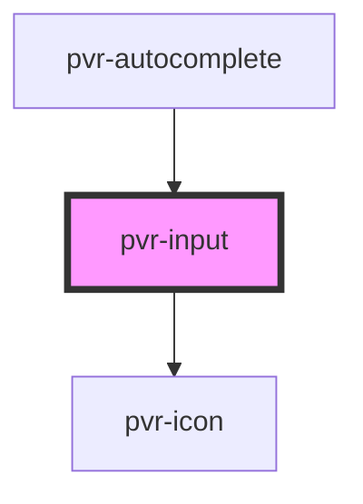

# pvr-input

<!-- Auto Generated Below -->

## Properties

| Property      | Attribute     | Description | Type                                                                                              | Default     |
| ------------- | ------------- | ----------- | ------------------------------------------------------------------------------------------------- | ----------- |
| `icon`        | `icon`        |             | `"check" \| "close" \| "download" \| "search" \| "settings" \| "stack" \| "sync" \| "transcribe"` | `undefined` |
| `placeholder` | `placeholder` |             | `string`                                                                                          | `undefined` |
| `width`       | `width`       |             | `string`                                                                                          | `undefined` |

## Events

| Event         | Description | Type               |
| ------------- | ----------- | ------------------ |
| `pvrKeyPress` |             | `CustomEvent<any>` |

## Dependencies

### Used by

 - [pvr-autocomplete](../pvr-autocomplete)

### Depends on

- [pvr-icon](../pvr-icon)

### Graph

----------------------------------------------

*Built with [StencilJS](https://stenciljs.com/)*
