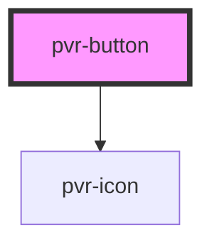

# pvr-button

<!-- Auto Generated Below -->

## Properties

| Property     | Attribute     | Description | Type                                   | Default     |
| ------------ | ------------- | ----------- | -------------------------------------- | ----------- |
| `border`     | `border`      |             | `boolean`                              | `false`     |
| `buttonIcon` | `button-icon` |             | `"cancel" \| "confirm"`                | `null`      |
| `buttonType` | `button-type` |             | `"primary" \| "secondary" \| "silent"` | `"primary"` |
| `disabled`   | `disabled`    |             | `boolean`                              | `false`     |

## Dependencies

### Depends on

- [pvr-icon](../pvr-icon)

### Graph

----------------------------------------------

*Built with [StencilJS](https://stenciljs.com/)*
