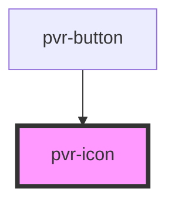

# pvr-button

<!-- Auto Generated Below -->

## Properties

| Property | Attribute | Description            | Type                    | Default     |
| -------- | --------- | ---------------------- | ----------------------- | ----------- |
| `type`   | `type`    | The role of the button | `"cancel" \| "confirm"` | `undefined` |

## Dependencies

### Used by

 - [pvr-button](../pvr-button)

### Graph

----------------------------------------------

*Built with [StencilJS](https://stenciljs.com/)*
